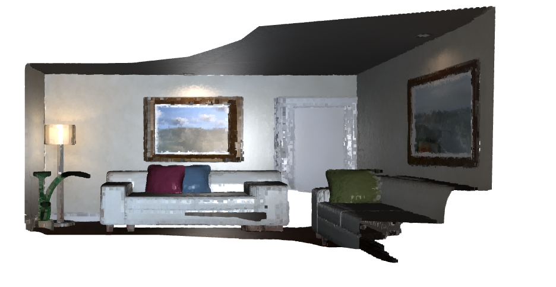
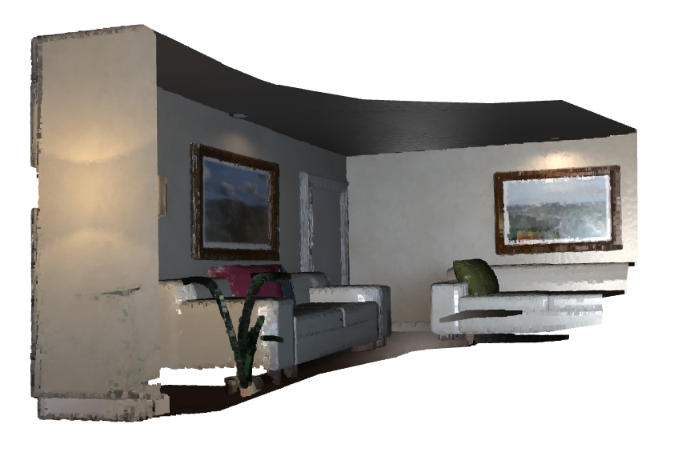
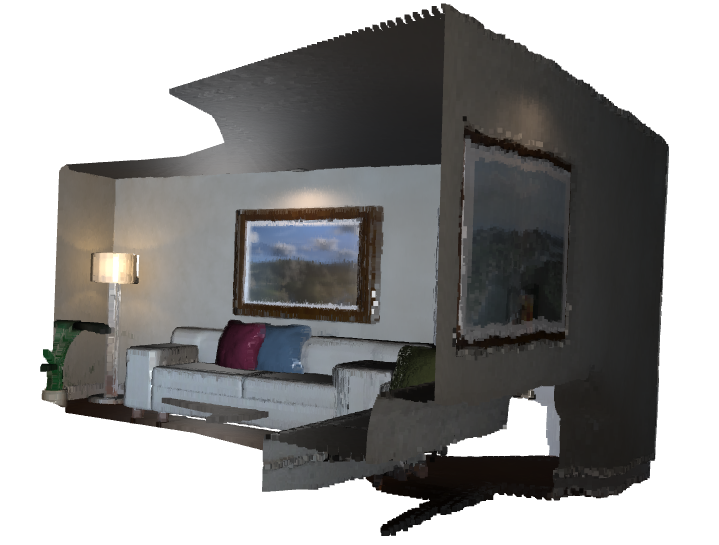
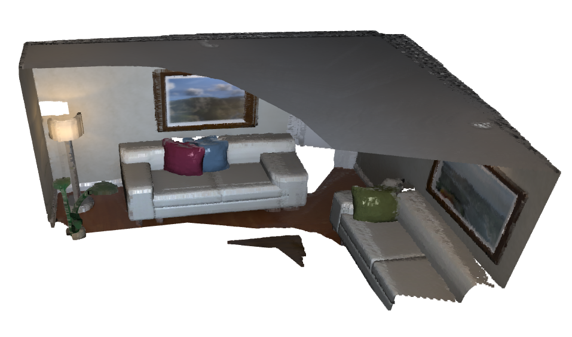
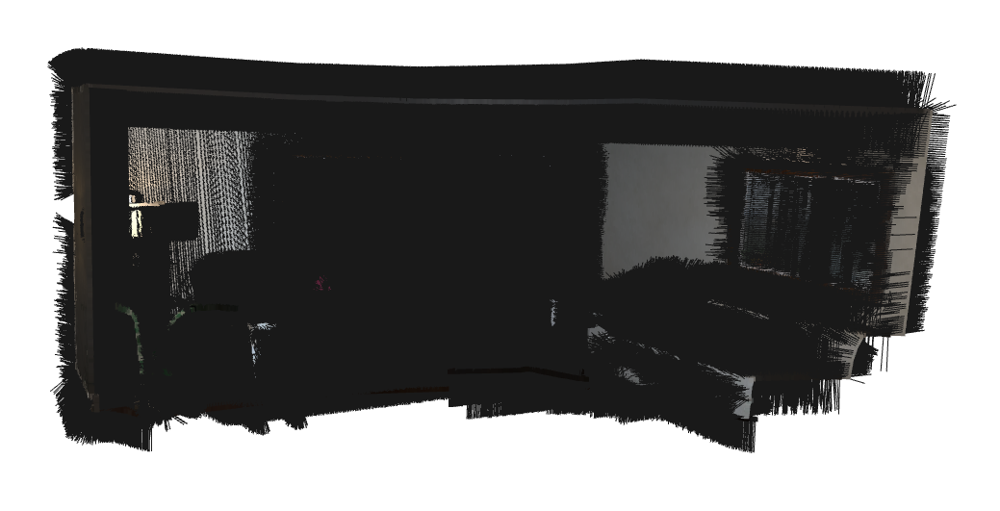
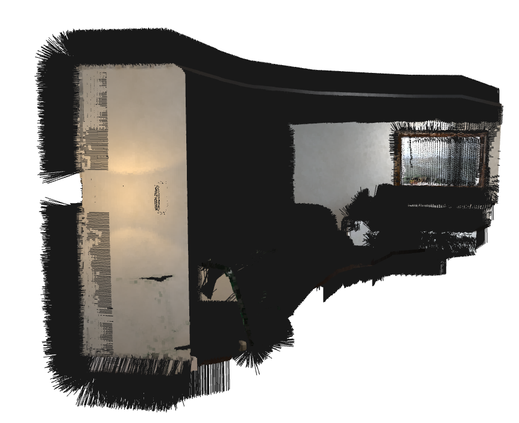
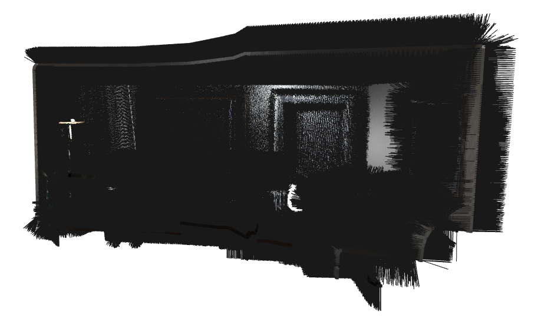
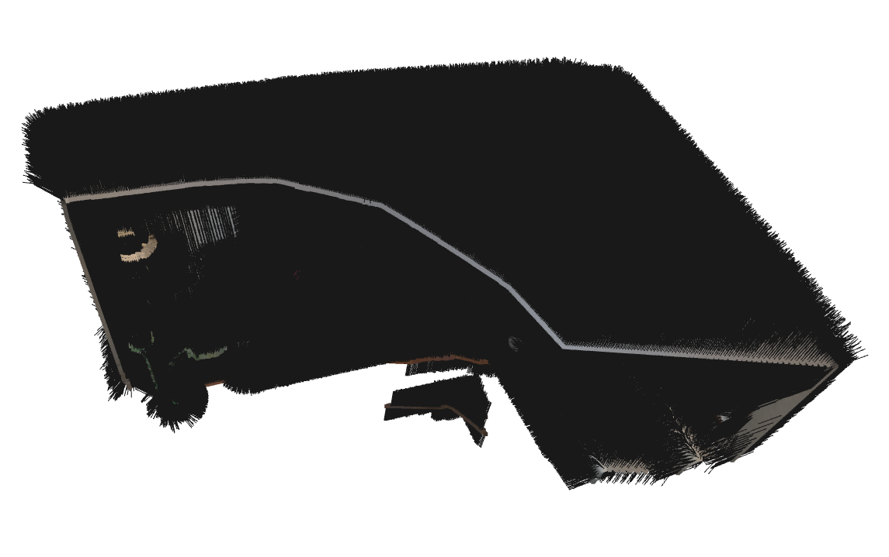
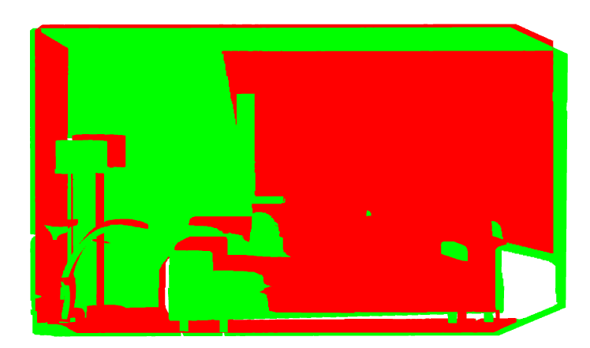
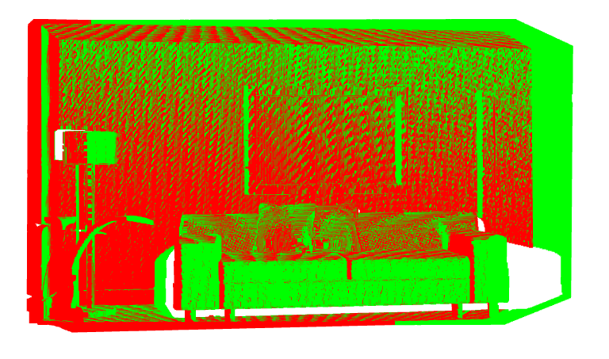

# Dense SLAM with Point-based Fusion

## Results

##### Dense Map

  
  
  
  

##### Normals

    <td></td>
    <td></td>
    <td></td>
    <td></td>

#### Preliminary Results(Projective Data Association)

ICP between 10 & 50 frame

    <td></td>
    <td></td>

